# Guion de Exposición: Polla Mundialista (3 Minutos)

Este documento contiene el guion estructurado para presentar el sistema en aproximadamente **3 minutos**. Úsalo como guía de apoyo durante tu exposición.

---

## ⏱️ Estructura del Tiempo (Total: 3 Minutos)

```mermaid
gantt
    title Distribución de la Exposición (180 segundos)
    dateFormat  X
    axisFormat %s
    section Diapositivas / Demostración
    Introducción y Arquitectura (30s) : 0, 30
    Acceso y Registro Seguro (45s)    : 30, 75
    Flujo del Usuario y Apuestas (45s) : 75, 120
    Consola de Administración (40s)   : 120, 160
    Conclusión y Cierre (20s)         : 160, 180
```

---

## 🎤 Guion Paso a Paso

### 1. Introducción y Arquitectura (0:00 - 0:30)
> **Acción del Expositor:** Muestra la pantalla inicial o la estructura del proyecto en el IDE.

* **Palabras clave:** "Buenos días/tardes. Hoy les presentaré nuestra **Polla Mundialista**, un sistema de apuestas de fútbol interactivo desarrollado en **Java Swing** y respaldado por una base de datos **MySQL**."
* **Detalle técnico rápido:** "El sistema sigue una arquitectura por capas:
  * **Modelo**: Para la representación de objetos (Usuarios, Partidos, Apuestas).
  * **DAO (Data Access Object)**: Para toda la persistencia mediante consultas preparadas en JDBC, asegurando protección contra inyección SQL.
  * **Controlador**: Que encapsula las reglas de negocio y cálculo de puntajes.
  * **Vista**: Componentes gráficos modernos optimizados para el Look & Feel del sistema."

---

### 2. Acceso Seguro y Roles (0:30 - 1:15)
> **Acción del Expositor:** Abre la ventana de Login, muestra la validación de ingreso de números, cambia a la vista de Registro y muestra el selector de rol.

* **Explicación del Acceso:** "La primera pantalla es el control de acceso. Implementamos un sistema seguro de registro e inicio de sesión con **roles diferenciados** (*Usuario* y *Administrador*)."
* **Demostración de robustez:** "Un aspecto clave del desarrollo es la **validación en tiempo real**. Si intento escribir letras en los campos de *Documento* o *Edad*, el sistema los bloquea al instante gracias a controladores de teclado (`KeyListeners`). Esto evita errores en el procesamiento de base de datos."
* **Control de Roles:** "Si me registro como Administrador e intento ingresar seleccionando el rol de Usuario, el sistema valida la discrepancia en la base de datos y me bloquea, asegurando la integridad de los privilegios."

---

### 3. Experiencia del Usuario (1:15 - 2:00)
> **Acción del Expositor:** Inicia sesión con una cuenta de **Usuario** (no admin). Navega rápidamente por las pestañas "Grupos", "Mis Pronósticos" y "Tablas".

* **El juego de la Polla:** "Al ingresar como usuario, accedemos a la interfaz principal. Contamos con varias funcionalidades clave:
  * **Visualización de Grupos:** Información en tiempo real de los equipos.
  * **Mis Pronósticos:** Aquí el usuario ingresa sus predicciones para los partidos. Los campos numéricos de goles están protegidos para evitar caracteres inválidos.
  * **Tabla de Posiciones Dinámica:** Se calcula de manera matemática e instantánea según los pronósticos del usuario o los resultados reales."
* **Gamificación (Leaderboard):** "En la pestaña de **Ranking General**, los usuarios pueden competir visualizando quién tiene más puntos en tiempo real. Los aciertos exactos otorgan 5 puntos y los aciertos de ganador/empate otorgan 3 puntos."

---

### 4. Consola del Administrador (2:00 - 2:40)
> **Acción del Expositor:** Cierra sesión, ingresa con una cuenta de **Administrador**, navega a la pestaña de "Resultados Oficiales".

* **Control de Resultados:** "Para el perfil de **Administrador**, el sistema deshabilita las pestañas de apuestas personales y de puntos superiores, y en su lugar habilita la sección de **Resultados Oficiales**."
* **Cálculo automatizado:** "Desde aquí, el administrador ingresa el marcador real de los partidos finalizados (usando `-1` para marcar partidos por jugar). Al guardar, el sistema dispara en segundo plano el recálculo automático de puntajes para todos los usuarios participantes en la base de datos, actualizando el ranking global al instante."

---

### 5. Conclusión y Cierre (2:40 - 3:00)
> **Acción del Expositor:** Muestra brevemente la pestaña de Historial de Actividad o el código de conexión.

* **Cierre:** "En resumen, este software no solo recrea la dinámica de una polla deportiva, sino que destaca por su robustez técnica: interfaces responsivas, multihilo para evitar congelamientos al consultar la base de datos y un estricto control de seguridad en tipos de datos. Quedo atento a cualquier pregunta que tengan. ¡Muchas gracias!"

---

## 💡 Consejos para la Exposición
1. **Sé Dinámico:** Habla despacio pero con entusiasmo. La gente capta mejor el entusiasmo.
2. **Interactúa con el Sistema:** Mientras explicas cada sección, haz clic y muestra cómo se comporta (por ejemplo, presiona letras en el teclado para demostrar que no se escriben).
3. **Menciona la Base de Datos:** Destaca que el cálculo de puntos y los rankings se realizan del lado del controlador de Java a partir de datos persistentes en MySQL de forma eficiente.
